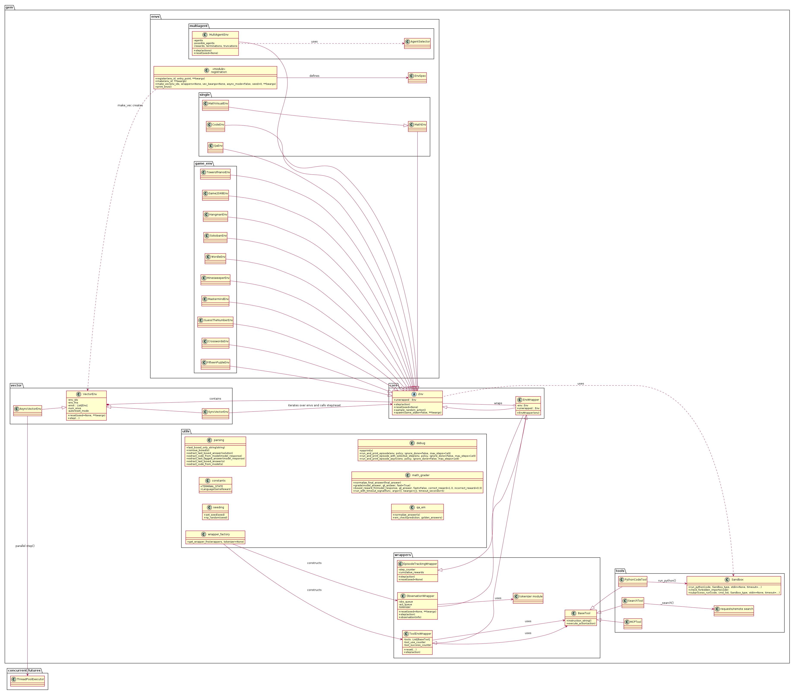

<div style="display:flex;gap:16px;align-items:center;margin-bottom:32px">
  
  
</div>


# [INF2070 - Reinforcement Learning - A Study About the 'GEM: A Gym For Agentic LLMs' publication](./README.md)

Este fork é uma análise do artigo e repositório do Framework proposto pelo artigo [GEM: A Gym For Agentic LLMs](https://arxiv.org/pdf/2510.01051) compatível com a versão [v0.1.0](https://github.com/axon-rl/gem/tree/2780ab6a7626c012092c045f5b9747062be35214) publicada em 5/10/2025.


## Arquitetura Identificada


<!-- Rendered diagram gerado a partir de class-diagram.plantuml -->


<!-- PlantUML source (para edição/visualização em VSCode com plugin PlantUML) -->
````puml
@startuml gem_class_diagram

top to bottom direction
skinparam ranksep 100
skinparam nodesep 50
skinparam classAttributeIconSize 0
skinparam shadowing false


package "concurrent.futures" {
  class ThreadPoolExecutor
}

package "gem" {

  package "core" {
    abstract class Env {
      + step(action)
      + reset(seed=None)
      + sample_random_action()
      + spawn(same_state=False, **kwargs)
      + unwrapped : Env
    }

    class EnvWrapper {
      - env: Env
      + EnvWrapper(env)
      + unwrapped : Env
    }
    Env <|-- EnvWrapper
    EnvWrapper o-- Env : wraps
  }

  package "vector" {
    class VectorEnv {
      - env_ids
      - env_fns
      - envs : List[Env]
      - num_envs
      - autoreset_mode
      + reset(seed=None, **kwargs)
      + step(...)
    }

    class SyncVectorEnv
    class AsyncVectorEnv

    Env ----* VectorEnv  : contains
    AsyncVectorEnv --|> VectorEnv
    VectorEnv <|-- SyncVectorEnv
    ThreadPoolExecutor <- AsyncVectorEnv : parallel step()
    SyncVectorEnv ----> Env : iterates over envs and calls step/reset

  }

  package "wrappers" {
    class ObservationWrapper {
      - obs_queue
      - act_queue
      - tokenizer
      + reset(seed=None, **kwargs)
      + step(action)
      + observation(info)
    }
    class EpisodeTrackingWrapper {
      - step_counter
      - cumulative_rewards
      + step(action)
      + reset(seed=None)
    }
    class ToolEnvWrapper {
      - tools: List[BaseTool]
      - tool_use_counter
      - tool_success_counter
      + reset(...)
      + step(action)
    }

    ObservationWrapper --|> EnvWrapper
    EnvWrapper --|> EpisodeTrackingWrapper
    EnvWrapper --|> ToolEnvWrapper
    ObservationWrapper --> "tokenizer module" : uses
    ToolEnvWrapper ---> BaseTool : uses
  }


  package "tools" {
    class BaseTool  {
      + instruction_string()
      + execute_action(action)
    } 
    class PythonCodeTool 
    class Sandbox
    class SearchTool
    class MCPTool

    BaseTool <|-- PythonCodeTool
    BaseTool <|-- SearchTool
    BaseTool <|-- MCPTool
    PythonCodeTool --> Sandbox : run_python()
    SearchTool --> "requests/remote search" : _search()
    BaseTool <-- ToolEnvWrapper : uses

    Sandbox <.. Env : uses
  }


  package "envs" {
    
    package "game_env" {
      left to right direction
      
      class GuessTheNumberEnv
      class MastermindEnv
      class MinesweeperEnv
      class WordleEnv
      class SokobanEnv
      class HangmanEnv
      class Game2048Env
      class TowerofHanoiEnv
      class FifteenPuzzleEnv
      class CrosswordsEnv

      GuessTheNumberEnv --|> Env
      MastermindEnv --|> Env
      MinesweeperEnv --|> Env
      WordleEnv --|> Env
      SokobanEnv --|> Env
      HangmanEnv --|> Env
      Game2048Env --|> Env
      TowerofHanoiEnv --|> Env
      FifteenPuzzleEnv --|> Env
      CrosswordsEnv --|> Env
    }


    package "multiagent" {
      class MultiAgentEnv {
        - agents
        - possible_agents
        - rewards, terminations, truncations
        + step(actions)
        + reset(seed=None)
      }
      class AgentSelector

      MultiAgentEnv ..> AgentSelector : uses
      MultiAgentEnv --|> Env
    }

    package "single" {
      
      class QaEnv
      class MathEnv
      class CodeEnv
      class MathVisualEnv

      QaEnv --|> Env
      MathEnv --|> Env
      CodeEnv --|> Env
      MathVisualEnv --|> MathEnv

    }

    class EnvSpec
    class registration <<module>> {
      + register(env_id, entry_point, **kwargs)
      + make(env_id, **kwargs)
      + make_vec(env_ids, wrappers=None, vec_kwargs=None, async_mode=False, seed=0, **kwargs)
      + print_envs()
    }
    registration --> EnvSpec : defines
    VectorEnv <.. registration  : make_vec creates

  }


  package "utils" {

    left to right direction
    
    
    class "wrapper_factory" as wrapper_factory {
      + get_wrapper_fns(wrappers, tokenizer=None)
    }

    class "seeding" as seeding {
      + set_seed(seed)
      + np_random(seed)
    }
    class "Sandbox" as Sandbox {
      + run_python(code, Sandbox_type, stdin=None, timeout=...)
      + check_forbidden_imports(code)
      + subprocess_run(code, cmd_list, Sandbox_type, stdin=None, timeout=...)
    }
    class "constants" as constants {
      + TERMINAL_STATE
      + LanguageGameReward
    }
    class "parsing" as parsing {
      + last_boxed_only_string(string)
      + remove_boxed(s)
      + extract_last_boxed_answer(solution)
      + extract_code_from_model(model_response)
      + extract_last_tagged_answer(model_response)
    }
    class "qa_em" as qa_em {
      + normalize_answer(s)
      + em_check(prediction, golden_answers)
    }
    class "math_grader" as math_grader {
      + normalize_final_answer(final_answer)
      + grade(model_answer, gt_answer, fast=True)
      + boxed_reward_fn(model_response, gt_answer, fast=False, correct_reward=1.0, incorrect_reward=0.0)
      + run_with_timeout_signal(func, args=(), kwargs={}, timeout_seconds=5)
    }
    class "debug" as debug {
      + ppprint(x)
      + run_and_print_episode(env, policy, ignore_done=False, max_steps=1e9)
      + run_and_print_episode_with_selective_step(env, policy, ignore_done=False, max_steps=1e9)
      + run_and_print_episode_async(env, policy, ignore_done=False, max_steps=1e9)
    }
    class "parsing" as parsing {
      + extract_last_boxed_answer(s)
      + extract_code_from_model(s)
    }
    class "qa_em" as qa_em


    wrapper_factory -down-> ObservationWrapper : constructs
    wrapper_factory -down-> ToolEnvWrapper : constructs

  }

}
@enduml

