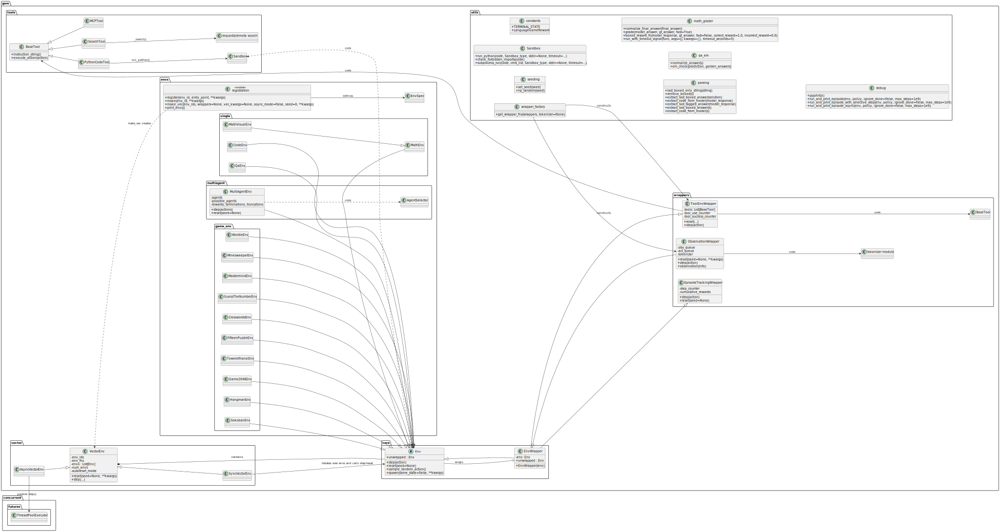

<div style="display:flex;gap:16px;align-items:center;margin-bottom:32px">
  
  
</div>


# INF2070 - Reinforcement Learning - GEM: A Gym For Agentic LLMs

Este fork é uma análise do artigo e repositório do Framework proposto pelo artigo [GEM: A Gym For Agentic LLMs](https://arxiv.org/pdf/2510.01051) compatível com a versão [v0.1.0](https://github.com/axon-rl/gem/tree/2780ab6a7626c012092c045f5b9747062be35214) publicada em 5/10/2025.

## Instruções para reprodução

### VSCode

> Instale o [VSCode](https://code.visualstudio.com/) conforme o seu sistema operacional.

### Python 3.12.12

Para a reprodução do reprositório é necessário utilizar a versão 3.12.12 do Python. Pode-se usar ferramentas como PyEnv, Conda ou ASDF para atingir esse objetivo.

Você pode verificar o comando utilizando o comando:

```bash
> python -V
```

#### Instalando versão específica do Python via ASDF

> Siga os passos indicados em [Getting Started](https://asdf-vm.com/pt-br/guide/getting-started.html) na página oficial do ASDF, levando em consideração o seu sistema operacional e tipo de terminal, como Bash ou ZSH.

Execute os comandos abaixo para instalar no seu ambiente.

```bash
> asdf plugin add python
> asdf install python 3.12.12
> asdf set python 3.12.12
```

### Virtual Env

Crie um ambiente Virtual Env rodando o comando no diretório raiz ao clone do repositório.

```bash
> python -m venv venv
```

> Este repositório está otimizado com arquivos das extensões e configurações de workspace do VSCode utilizando o Venv


Para ativar o ambiente, execute o comando

```bash
> source venv/bin/activate
```


## Arquitetura Identificada

