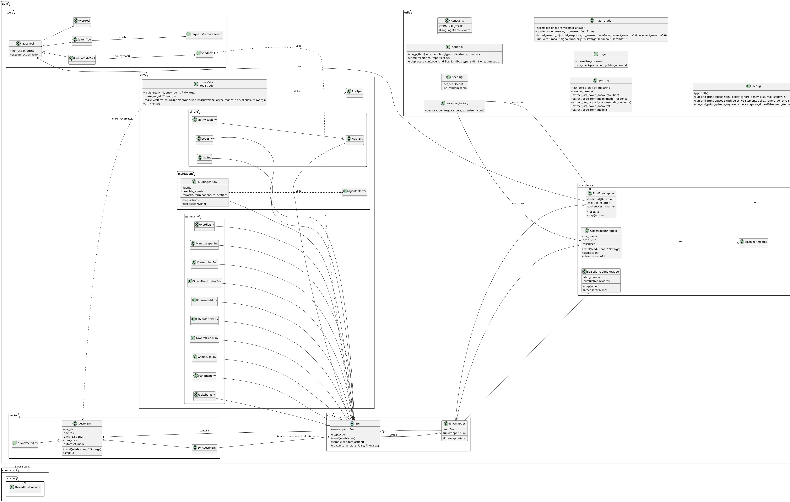

<div style="display:flex;gap:16px;align-items:center;margin-bottom:32px">
  
  
</div>


# INF2070 - Reinforcement Learning - GEM: A Gym For Agentic LLMs

Este fork é uma análise do artigo e repositório do Framework proposto pelo artigo [GEM: A Gym For Agentic LLMs](https://arxiv.org/pdf/2510.01051) compatível com a versão [v0.1.0](https://github.com/axon-rl/gem/tree/2780ab6a7626c012092c045f5b9747062be35214) publicada em 5/10/2025.

## Instruções para reprodução

### VSCode

> Instale o [VSCode](https://code.visualstudio.com/) conforme o seu sistema operacional.

### Python 3.12.12

Para a reprodução do reprositório é necessário utilizar a versão 3.12.12 do [Python](https://www.python.org/downloads/). Pode-se usar ferramentas como [PyEnv](https://github.com/pyenv/pyenv), [Conda](https://anaconda.org/anaconda/conda) ou ASDF para atingir esse objetivo.

Você pode verificar o comando utilizando o comando:

```bash
> python -V
```

> Ferramentas como PyEnv e ASDF podem requerer instalações extras devido a compilação para instalação compatível ao sistema operacional utilizado. [Esta página](https://github.com/pyenv/pyenv/wiki#suggested-build-environment) detalha para diversas  distribuições Linux e outros sistemas operacionais


#### Instalando versão específica do Python via ASDF

> Siga os passos indicados em [Getting Started](https://asdf-vm.com/pt-br/guide/getting-started.html) na página oficial do ASDF, levando em consideração o seu sistema operacional e tipo de terminal, como Bash ou ZSH.

Execute os comandos abaixo para instalar no seu ambiente.

```bash
> asdf plugin add python
> asdf install python 3.12.12
> asdf set python 3.12.12
```

> Verifique se o arquivo .tool-versions contém a versão instalada

### Virtual Env

Crie um ambiente Virtual Env rodando o comando no diretório raiz ao clone do repositório.

```bash
> python -m venv venv
```

> Este repositório está otimizado com arquivos das extensões e configurações de workspace do VSCode utilizando o Venv


Para ativar o ambiente, execute o comando

```bash
> source venv/bin/activate
```

### Instalação de dependências


Como parte das instruções padrão, pode-se instalar as dependências do projeto

```bash
> pip install -e .
```

Para executar os testes automatizados, é necessário instalar os comandos:

```bash
> pip install pytest fire fastmcp
```

Para instalar as dependências de execução dos notebooks, execute:


```bash
> pip install ipykernel matplotlib-inline jupyter_client jupyter_core ipython jedi pandas numpy openpyxl
```


### Execução de Testes Automatizados


Alguns testes apresentaram falhas de execução nesta versão


```bash
pytest             
============================================================================================== test session starts ===============================================================================================
platform linux -- Python 3.12.12, pytest-8.4.2, pluggy-1.6.0
rootdir: /home/yang/projects/inf2070-gym
configfile: pyproject.toml
plugins: anyio-4.11.0
collected 36 items / 3 errors                                                                                                                                                                                    

===================================================================================================== ERRORS =====================================================================================================
__________________________________________________________________________________ ERROR collecting tests/test_env/test_game.py __________________________________________________________________________________
ImportError while importing test module '/home/yang/projects/inf2070-gym/tests/test_env/test_game.py'.
Hint: make sure your test modules/packages have valid Python names.
Traceback:
../../.asdf/installs/python/3.12.12/lib/python3.12/importlib/__init__.py:90: in import_module
    return _bootstrap._gcd_import(name[level:], package, level)
           ^^^^^^^^^^^^^^^^^^^^^^^^^^^^^^^^^^^^^^^^^^^^^^^^^^^^
tests/test_env/test_game.py:19: in <module>
    from gem.utils.debug import run_and_print_episode_with_random_selection
E   ImportError: cannot import name 'run_and_print_episode_with_random_selection' from 'gem.utils.debug' (/home/yang/projects/inf2070-gym/gem/utils/debug.py)
________________________________________________________________________________ ERROR collecting tests/test_env/test_terminal.py ________________________________________________________________________________
ImportError while importing test module '/home/yang/projects/inf2070-gym/tests/test_env/test_terminal.py'.
Hint: make sure your test modules/packages have valid Python names.
Traceback:
../../.asdf/installs/python/3.12.12/lib/python3.12/importlib/__init__.py:90: in import_module
    return _bootstrap._gcd_import(name[level:], package, level)
           ^^^^^^^^^^^^^^^^^^^^^^^^^^^^^^^^^^^^^^^^^^^^^^^^^^^^
tests/test_env/test_terminal.py:21: in <module>
    from gem.envs.terminal.docker_env import ContainerConfig, DockerEnv, TaskConfig
gem/envs/terminal/docker_env.py:26: in <module>
    from terminal_bench.handlers.trial_handler import TrialHandler
E   ModuleNotFoundError: No module named 'terminal_bench'
___________________________________________________________________________ ERROR collecting tests/test_multiagent/test_multiagent.py ____________________________________________________________________________
ImportError while importing test module '/home/yang/projects/inf2070-gym/tests/test_multiagent/test_multiagent.py'.
Hint: make sure your test modules/packages have valid Python names.
Traceback:
../../.asdf/installs/python/3.12.12/lib/python3.12/importlib/__init__.py:90: in import_module
    return _bootstrap._gcd_import(name[level:], package, level)
           ^^^^^^^^^^^^^^^^^^^^^^^^^^^^^^^^^^^^^^^^^^^^^^^^^^^^
tests/test_multiagent/test_multiagent.py:21: in <module>
    from gem.multiagent import AgentSelector, MultiAgentEnv
E   ModuleNotFoundError: No module named 'gem.multiagent'
============================================================================================ short test summary info =============================================================================================
ERROR tests/test_env/test_game.py
ERROR tests/test_env/test_terminal.py
ERROR tests/test_multiagent/test_multiagent.py
!!!!!!!!!!!!!!!!!!!!!!!!!!!!!!!!!!!!!!!!!!!!!!!!!!!!!!!!!!!!!!!!!!!!!!!!!!!!!!!!!!!! Interrupted: 3 errors during collection !!!!!!!!!!!!!!!!!!!!!!!!!!!!!!!!!!!!!!!!!!!!!!!!!!!!!!!!!!!!!!!!!!!!!!!!!!!!!!!!!!!!!
=============================================================================================== 3 errors in 10.32s ===============================================================================================
```

## Arquitetura Identificada




## Notebooks de Experimentação

O diretório [inf2070-studies/notebooks](./notebooks) implementa alguns notebooks utilizados para experimentar o projeto GEM:

- [Getting Started](./notebooks/getting-started.ipynb)